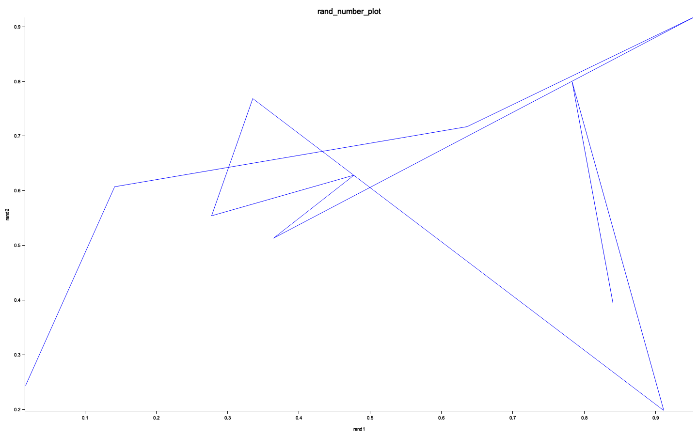
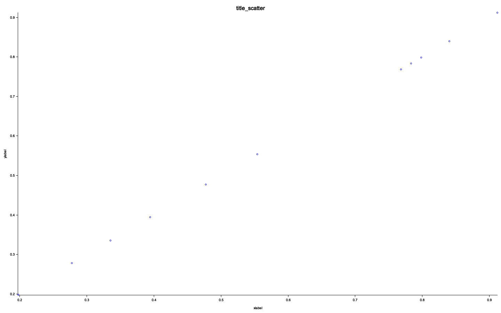

# tmplot
# [RECOMMEND] [tmplot.py](https://github.com/th2ch-g/tmplot.py) is more highly functional

Plotter for when you just want to draw a little diagram.  
File and PIPE input are supported.  
Also supports PNG, JPG output. Default output format is PNG.

## Install tmplot

There are 2 ways to install.

### 1. Install by cargo
~~~
cargo install --git https://github.com/th2ch-g/tmplot.git
~~~
The executable file is in `~/.cargo/bin/tmplot`

### 2. Install from source
~~~
git clone https://github.com/th2ch-g/tmplot.git && \
cd ./tmplot && \
cargo build --release
~~~
The executable file is in `./target/release/tmplot`

## Quick start & Examples
### Ex1. PIPE & prefix, xlabel, ylabel, title input
~~~
$ for i in {0..10}; do echo ""; done | awk '{print rand(), rand()}' | \
    tmplot plot -x - -y - --prefix random_number --xlabel rand1 --ylabel rand2 --title rand_number

[INFO] Plot mode execute...
[INFO] PIPE data seems to be SPACE split
[INFO] tmplot done
~~~
Then you can get a figure like the one below

### Ex2. PIPE & FILE & JPG output
~~~
$ for i in {0..10}; do echo ""; done | awk '{print rand()}' > test.txt && \
    for i in {0..10}; do echo ""; done | awk '{print rand()}' | \
    tmplot scatter -x - -y test.txt --jpg && rm -f test.txt

[INFO] Plot mode execute...
[INFO] tmplot done
~~~

Then you can get a figure like the one below

## Subcommand
~~~
USAGE:
    tmplot <SUBCOMMAND>

OPTIONS:
    -h, --help       Print help information
    -V, --version    Print version information

SUBCOMMANDS:
    plot       Simple plot Connecting dots to draw
    scatter    Simple plot NOT Connecting dots to draw
    help       Print this message or the help of the given subcommand(s)
~~~

## Options

## plot mode
~~~
USAGE:
    tmplot plot [OPTIONS] --xdata <DATA> --ydata <DATA>

OPTIONS:
    -x, --xdata <DATA>    x_data of 2D-plot.
                          Supports FILE name or PIPE input. For pipe input, use "-x - "
    -y, --ydata <DATA>    y_data of 2D-plot.
                          Supports FILE name or PIPE input. For pipe input, use "-y - "
        --prefix <STR>    output picture file prefix [default: out]
        --xlabel <STR>    output picture xlabel [default: xlabel]
        --ylabel <STR>    output picture ylabel [default: ylabel]
        --title <STR>     output picture title [default: title]
        --jpg             Flag whether JPG output is performed.
    -h, --help            Print help information
    -V, --version         Print version information
~~~

## scatter mode
~~~
USAGE:
    tmplot scatter [OPTIONS] --xdata <DATA> --ydata <DATA>

OPTIONS:
    -x, --xdata <DATA>    x_data of 2D-plot.
                          Supports FILE name or PIPE input. For pipe input, use "-x - "
    -y, --ydata <DATA>    y_data of 2D-plot.
                          Supports FILE name or PIPE input. For pipe input, use "-y - "
        --prefix <STR>    output picture file prefix [default: out]
        --xlabel <STR>    output picture xlabel [default: xlabel]
        --ylabel <STR>    output picture ylabel [default: ylabel]
        --title <STR>     output picture title [default: title]
        --jpg             Flag whether JPG output is performed.
    -h, --help            Print help information
    -V, --version         Print version information
~~~

